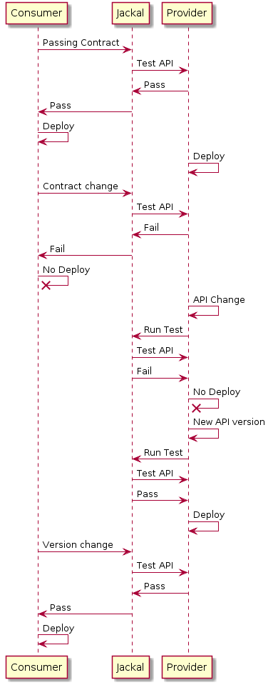

# Jackal

[](https://www.npmjs.com/package/jackal)
[](https://www.npmjs.com/package/jackal)
[](https://travis-ci.org/findmypast-oss/jackal)
[](https://coveralls.io/github/findmypast-oss/jackal?branch=master)
[](https://snyk.io/test/github/findmypast-oss/jackal)
[](https://github.com/findmypast-oss/jackal/graphs/contributors)
[](https://github.com/findmypast-oss/jackal/blob/master/LICENSE)

Jackal is a consumer-driven contracts microservice designed to prevent breaking API changes being released by either consumers or providers of APIs.

## Documentation

In order to help with using or contributing to Jackal a selection of documentation can be found in this repository:

- [API Guide](docs/api.md)
- [Client Guide](docs/client.md)
- [Config Guide](docs/config.md)
- [Contract Guide](docs/contract.md)
- [Development Guide](docs/development.md)
- [Result Guide](docs/result.md)
- [Statistics Guide](docs/statistics.md)
- [Validation Guide](docs/validation.md)

The remainder of the README is a quick start guide aimed at allowing users to start a Jackal server and test contracts for both a consumer and provider. A diagram illustrating our expected use case is also included at the bottom of this file.

## Quickstart Guide

### Local

To install Jackal

```
npm i -g jackal
```

To start a local instance of the Jackal server with the default configuration using the Jackal client:

```
jackal start
```

Alternatively, to specify a custom configuration file:

```
// Using a JSON configuration file
jackal start -c /path/to/custom/config.json

// Using a YAML configuration file
jackal start -c /path/to/custom/config.yaml
```

Make sure to define a custom configuration file, both JSON and YAML formats are supported, the default configuration is as follows:

```yaml
db:
  path: db.json
logger:
  environment: development
statsD:
  host: localhost
  port: 8125
  prefix: jackal

```

Jackal should now be available at `http://localhost:25863`, a health endpoint is provided at `/api/health`.

### Docker

To start a dockerised instance of Jackal with the default configuration:

```
docker run -p 25863:25863 findmypast/jackal
```

Jackal should now be available at `http://localhost:25863`, a health endpoint is provided at `/api/health`

### Testing Contracts as a Consumer

#### Contracts file

Make sure to define a contracts file, e.g:

```yaml
itunes_search_app:                # consumer name
  itunes:                         # provider name
    search_by_term_and_country:   # api endpoint name
      OK:                         # scenario name
        request:
          baseUrl: 'https://itunes.apple.com'
          path: '/search'
          query: '?term=mclusky&country=gb'
          method: GET
          headers:
            Header-Name: headerValue
            Another-Header-Name: headerValue
          timeout: 1000
        response:
          statusCode: 200
          body:                   # body uses Joi type definitions (https://github.com/hapijs/joi)
            resultCount: 'Joi.number().integer()'
            results:
              - trackName: Joi.string()
                collectionName: Joi.string()
```

The file is also accepted in the equivalent JSON format, make sure to specify either a `.yaml`, `.yml` or `.json` extension.

#### Contracts Directory

In order to prevent large, unwieldy contracts files becoming a necessity, it is possible to specify contracts for a single consumer across multiple files. This behaviour is only possible when using the Jackal client to communicate with the Jackal server - it is __not__ possible to upload many files to the server in a single request.

Each file must follow the format illustrated above and must share a common consumer at the top level. Currently, these files are merged at consumer level, so if a provider is defined in multiple files then contracts defined for the same provider in a later file may overwrite those in an earlier one.

#### Sending the Contracts

##### Using the Jackal Client

Contracts can be sent to a Jackal server using the Jackal client by specifying the URL of the Jackal server and the path to the contracts file or directory:

```
jackal send <jackalUrl> <contractsPath>
```

By default, the results of sending contracts to a Jackal server using the client are displayed in `spec` format, for information on how to specify alternatives, please consult the [Jackal Client Guide](https://github.com/findmypast-oss/jackal/blob/master/docs/client.md).

##### Using Curl

Contracts can also be sent to a Jackal server using curl (or similar), however only a single contracts file can be sent, sending a directory of files is __not__ possible:

```bash
curl -X POST --silent http://jackal.url:25863/api/contracts -H 'Content-Type: application/json' -d @contracts.json
```

You should then receive a JSON object in response, for example:
```json
{
  "message": "All Passed",
  "status": "PASSED",
  "results": [
    {
      "name": "itunes/search_by_term_and_country/OK",
      "consumer": "itunes_search_app",
      "status": "Pass",
      "error": null
    }
  ]
}
```

### Testing Contracts as a Provider

##### Using the Jackal Client

Provider contracts stored on a Jackal server can be run using the Jackal client by specifying the URL of the Jackal server and the name of the provider for which contracts should be run:

```
jackal run <jackalUrl> <providerName>
```

By default, the results of running provider contracts on a Jackal server using the client are displayed in `spec` format, for information on how to specify alternatives, please consult the [Jackal Client Guide](https://github.com/findmypast-oss/jackal/blob/master/docs/client.md).

##### Using Curl

Provider contracts stored on a Jackal server can also be run using curl (or similar):

```bash
curl -X GET --silent http://localhost:25863/api/contracts/PROVIDER_NAME -H 'Content-Type: application/json'
```

You should then receive a JSON object in response, for example:
```json
{
  "message": "All Passed",
  "status": "PASSED",
  "results": [
    {
      "name": "itunes/search_by_term_and_country/OK",
      "consumer": "itunes_search_app",
      "status": "Pass",
      "error": null
    }
  ]
}
```

### Sequence of Testing

